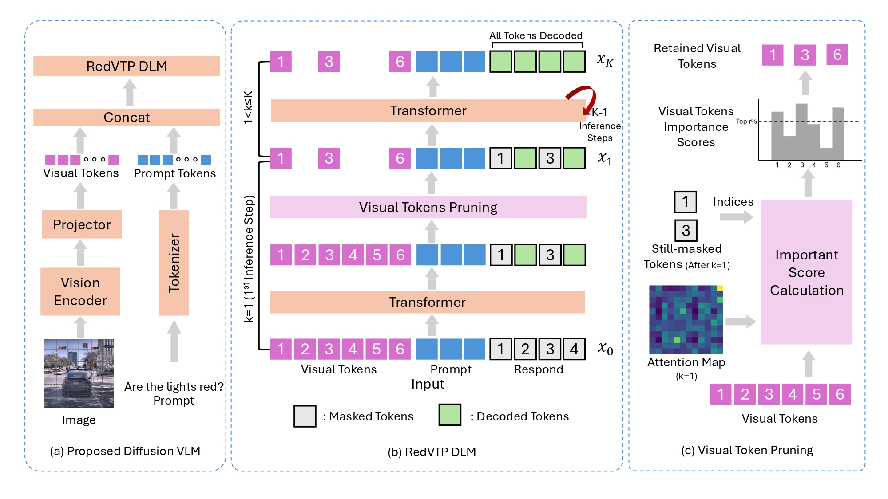

# RedVTP: Training-Free Acceleration of Diffusion Vision-Language Models Inference via Masked Token-Guided Visual Token Pruning
1. We propose RedVTP, to the best of our knowledge, the first approach that accelerates inference in Diffusion Vision-Language Models(DVLMs) through visual token pruning.
2. We introduce a response-driven visual token pruning strategy that innovatively leverages still masked tokens to measure importance of visual tokens and prunes less important ones.
3. Experiments show that RedVTP improves token generation throughput of LLaDA-V and LaViDa by up to 186% and 28.05%, respectively, and reduces inference latency by up to 64.97% and 21.87%, without compromising—and in some cases improving—accuracy.
## Overview

---
---

## Repositories

RedVTP is implemented on top of two DVLMs baselines.  
Please visit the corresponding repositories below for installation and inference instructions.

- **RedVTP-LLaDA-V**  
  https://github.com/Blacktower27/RedVTP-LLaDA-V

- **RedVTP-LaViDa**  
  https://github.com/Blacktower27/RedVTP-LaViDa

Each repository contains the minimal modified baseline code and the pruning-based inference scripts.

---

